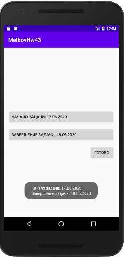

## Задача 3. CalendarView «Сроки задачи».
### Описание
При работе с мобильными приложениями приходится часто работать с выбором дат. Создайте мобильное приложение “Сроки задачи” со следующими элементами:
- CalendarView для даты- дата-время старта задачи
- CalendarView для даты- дата-время окончания задачи
- Кнопку ОК, по клику на которую проверяем, чтобы дата старта была меньше даты окончания:
    - Если проверка пройдена - выводим Toast с выбранными датами.
    - Если не пройдена - выводим в Toast сообщение об ошибке и очищаем поля ввода дат.

